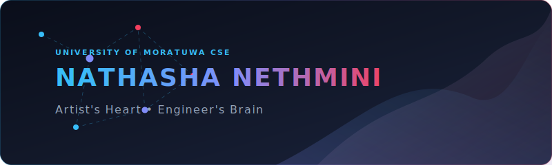

<!-- Premium Animated Banner -->

  

  

  
  

 

  

 

## 🌟 About Me

I am an undergraduate **Computer Science and Engineering** student at the **University of Moratuwa, Sri Lanka**. I am deeply passionate about software engineering, artificial intelligence, and building practical solutions to real-world problems.

I am currently exploring areas such as machine learning, backend development, databases, systems programming, and computer architecture:
- 🧠 **Machine Learning & AI** — Building ML projects, data preprocessing, model training and evaluation, and handwritten digit recognition.

> *Good software is not only about writing code but also about understanding users, designing meaningful solutions, and creating positive experiences.*

  

## 💻 Tech Stack & Tools

<table align="center" style="border: none; background-color: transparent;">
  <tr>
    <td align="right" width="200"><b>Languages</b></td>
    <td></td>
  </tr>
  <tr>
    <td align="right" width="200"><b>Frontend</b></td>
    <td></td>
  </tr>
  <tr>
    <td align="right" width="200"><b>Backend</b></td>
    <td></td>
  </tr>
  <tr>
    <td align="right" width="200"><b>Databases</b></td>
    <td></td>
  </tr>
  <tr>
    <td align="right" width="200"><b>Tools & Design</b></td>
    <td></td>
  </tr>
</table>

  

## 🚀 Focus & Goals

<table width="100%" style="border: none; background-color: transparent;">
  <tr>
    <td valign="top" width="50%">
      <h3>🛠️ Currently Working On</h3>
      <ul>
        <li>Coursework and academic projects at the University of Moratuwa.</li>
        <li>Developing practical, user-centric software solutions.</li>
      </ul>
    </td>
    <td valign="top" width="50%">
      <h3>🌱 Currently Learning</h3>
      <ul>
        <li>Full-Stack Development</li>
        <li>Cloud Computing & DevOps</li>
        <li>Software Quality Engineering</li>
        <li>AI-powered Software Engineering</li>
      </ul>
    </td>
  </tr>
  <tr>
    <td valign="top" width="50%">
      <h3>💡 Areas of Interest</h3>
      <ul>
        <li>Machine Learning & Artificial Intelligence</li>
        <li>Backend Development & Databases</li>
        <li>Systems Programming & Computer Architecture</li>
      </ul>
    </td>
    <td valign="top" width="50%">
      <h3>✨ Fun Facts</h3>
      <ul>
        <li>I believe in having an artist's heart with an engineer's brain.</li>
      </ul>
    </td>
  </tr>
</table>

  

## 📊 GitHub Analytics

  
  

 

  <h3>✨ "Wavelengths of music, strokes of art, and lines of code." ✨</h3>
  
🚀 <i>Always learning. Always building.</i>

  
<b>My ultimate goal is to become a versatile software engineer who combines strong technical foundations with creativity to build reliable, intelligent, and impactful systems.</b>

