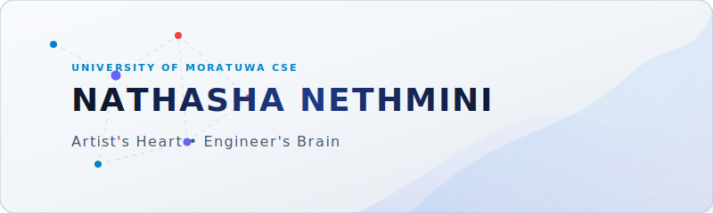

<!-- Premium Animated Banner -->

  <picture>
    <source media="(prefers-color-scheme: dark)" srcset="./banner-dark.svg">
    <source media="(prefers-color-scheme: light)" srcset="./banner-light.svg">
    
  </picture>

  <picture>
    <source media="(prefers-color-scheme: dark)" srcset="https://readme-typing-svg.demolab.com?font=Fira+Code&weight=600&size=20&pause=1000&color=38BDF8&center=true&vCenter=true&width=800&lines=Aspiring+Software+Engineer;AI+%26+Software+Engineering+Enthusiast;Exploring+Machine+Learning+%26+Systems;Computer+Science+%26+Engineering+Undergraduate+%7C+University+of+Moratuwa">
    <source media="(prefers-color-scheme: light)" srcset="https://readme-typing-svg.demolab.com?font=Fira+Code&weight=600&size=20&pause=1000&color=0F172A&center=true&vCenter=true&width=800&lines=Aspiring+Software+Engineer;AI+%26+Software+Engineering+Enthusiast;Exploring+Machine+Learning+%26+Systems;Computer+Science+%26+Engineering+Undergraduate+%7C+University+of+Moratuwa">
    
  </picture>

  
  

 

  

 

## Hello World

## Hello World 👋

I'm Nathasha Nethmini, a Computer Science and Engineering undergraduate at the University of Moratuwa, Sri Lanka. I am interested in software engineering, artificial intelligence, backend development, and computer systems. I enjoy learning through building projects and exploring how technology can be used to create reliable and meaningful solutions.

---

### What I'm up to right now:
- **Studying:** Computer Science & Engineering at UoM Sri Lanka.
- **Exploring:** Machine Learning & AI, backend systems, database management, and computer architecture.
- **Learning:** Full-Stack development, DevOps pipelines, and AI-driven software engineering.
- **Looking for:** Open-source collaborations, research opportunities, and software engineering internships.

---

### My Toolbox

  

---

### GitHub Activity

  <picture>
    <source media="(prefers-color-scheme: dark)" srcset="https://github-readme-streak-stats.herokuapp.com/?user=nathasha-nethmini&theme=tokyonight">
    <source media="(prefers-color-scheme: light)" srcset="https://github-readme-streak-stats.herokuapp.com/?user=nathasha-nethmini&theme=default">
    
  </picture>
  <picture>
    <source media="(prefers-color-scheme: dark)" srcset="https://github-stats-extended.vercel.app/api/top-langs/?username=nathasha-nethmini&layout=compact&theme=tokyonight&hide=jupyter%20notebook">
    <source media="(prefers-color-scheme: light)" srcset="https://github-stats-extended.vercel.app/api/top-langs/?username=nathasha-nethmini&layout=compact&theme=default&hide=jupyter%20notebook">
    
  </picture>

 

  <h3>"Wavelengths of music, strokes of art, and lines of code."</h3>
  
<i>Always learning. Always building.</i>

