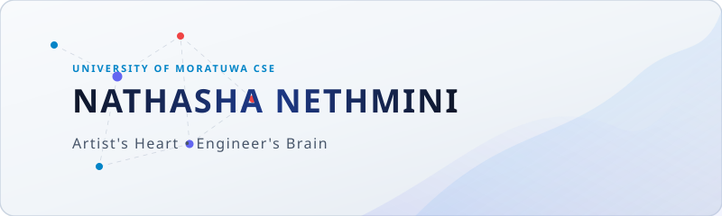

  <picture>
    <source media="(prefers-color-scheme: dark)" srcset="./banner-dark.svg">
    <source media="(prefers-color-scheme: light)" srcset="./banner-light.svg">
    
  </picture>

  <picture>
    <source media="(prefers-color-scheme: dark)" srcset="https://readme-typing-svg.demolab.com?font=Fira+Code&weight=600&size=20&pause=1000&color=38BDF8&center=true&vCenter=true&width=800&lines=Aspiring+Software+Engineer;AI+%26+Machine+Learning+Enthusiast;Full-Stack+Developer+%26+Systems+Explorer;Computer+Science+Undergrad+%40+UoM">
    <source media="(prefers-color-scheme: light)" srcset="https://readme-typing-svg.demolab.com?font=Fira+Code&weight=600&size=20&pause=1000&color=0F172A&center=true&vCenter=true&width=800&lines=Aspiring+Software+Engineer;AI+%26+Machine+Learning+Enthusiast;Full-Stack+Developer+%26+Systems+Explorer;Computer+Science+Undergrad+%40+UoM">
    
  </picture>

  
  
  

 

  <i><b>"Wavelengths of music, strokes of art, and lines of code."</b></i> 
  🎓 Computer Science & Engineering Undergraduate @ University of Moratuwa

 

## About Me

- I’m currently building **CodeSage AI**, an AI-powered technical debt analytics system, and **OnTime G2**, a real-time transit telemetry pipeline.
- I’m deeply exploring **Applied Machine Learning**, **Distributed Systems**, and **Agentic AI**.
- Recognized on the **Dean's List** for academic excellence (CGPA: 3.35/4.00).
- Ask me about **Python, React, FastAPI, Kafka, and Machine Learning workflows**.
- Reach out to me for **Software Engineering Internships, Open-Source Collaborations, or Research Opportunities**.

 

## Technologies & Tools

  

 

## Featured Projects

<b>CodeSage AI – Technical Debt Analytics Dashboard</b> <i>(Python, Next.js, FastAPI, PostgreSQL, Celery, Redis)</i>

 
An AI-powered technical debt analytics system combining static analysis (Tree-sitter, CK), repository mining (PyDriller), and an SVM SATD classifier to identify and prioritize technical debt. Built asynchronous workflows with FastAPI and Celery.

<b>OnTime G2 – Real-Time Transit Analytics</b> <i>(Apache Kafka, Apache Flink, Docker, XGBoost, Python)</i>

 
Designed a real-time public transport tracking and ETA prediction system using event-driven streaming with Kafka and Flink. Utilized XGBoost for ETA generation and displayed live telemetry on an interactive map.

<b>Steamnoodles Feedback Agent</b> <i>(LLaMA 3, LangChain, Flask, Pandas)</i>

 
An AI-powered restaurant feedback system using LLaMA 3 for sentiment analysis. Classifies feedback and generates context-aware responses, visualized on a Flask backend.

<b>Cook With Ashi</b> <i>(MERN Stack, Twilio API)</i>

 
Full-stack application connecting customers with home-based food providers. Integrated Twilio WhatsApp API for real-time communication.

 

## GitHub Analytics

  <picture>
    <source media="(prefers-color-scheme: dark)" srcset="https://github-stats-extended.vercel.app/api/top-langs/?username=nathasha-nethmini&layout=compact&theme=tokyonight&hide=jupyter%20notebook">
    <source media="(prefers-color-scheme: light)" srcset="https://github-stats-extended.vercel.app/api/top-langs/?username=nathasha-nethmini&layout=compact&theme=default&hide=jupyter%20notebook">
    
  </picture>

 

  

